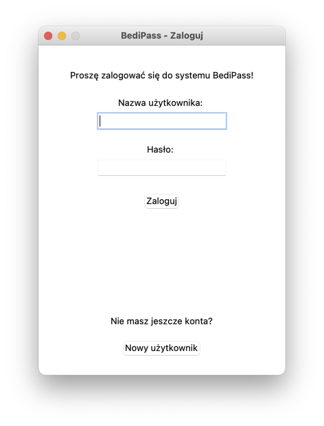
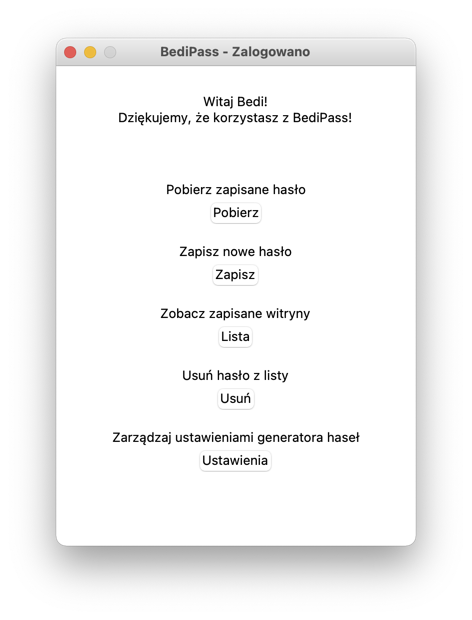
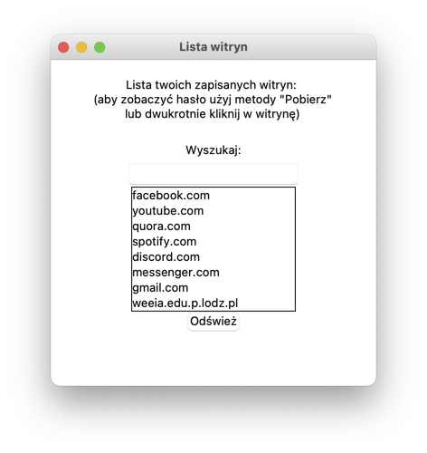
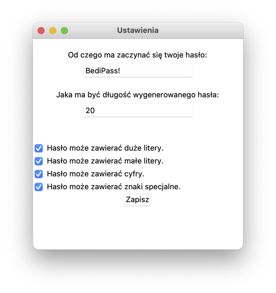

# BediPass
Bardzo prosta aplikacja do generowania i przetrzymawania haseł do stron internetowych w szyfrowanych bazach danych.
### Erkan logowania.
  
### Głowny erkan po zalogowaniu z wszystkimi możliwościami
  
Po poprawnym zalogowaniu przy pomocy naszych danych logowania tworzy sie specjalny klucz który odpowiada za rozszyfrowanie danych z naszej bazy danych.
### Ekran listy zapisanych haseł.
  
Po dwukrotnym kliknięciu hasło kopiuje nam się do schowka dzięki czemu nie musimy przepisywać długich i trudnych, ale dzięki temu trudnych do złamania haseł.
### Ekran ustawień. 
  
